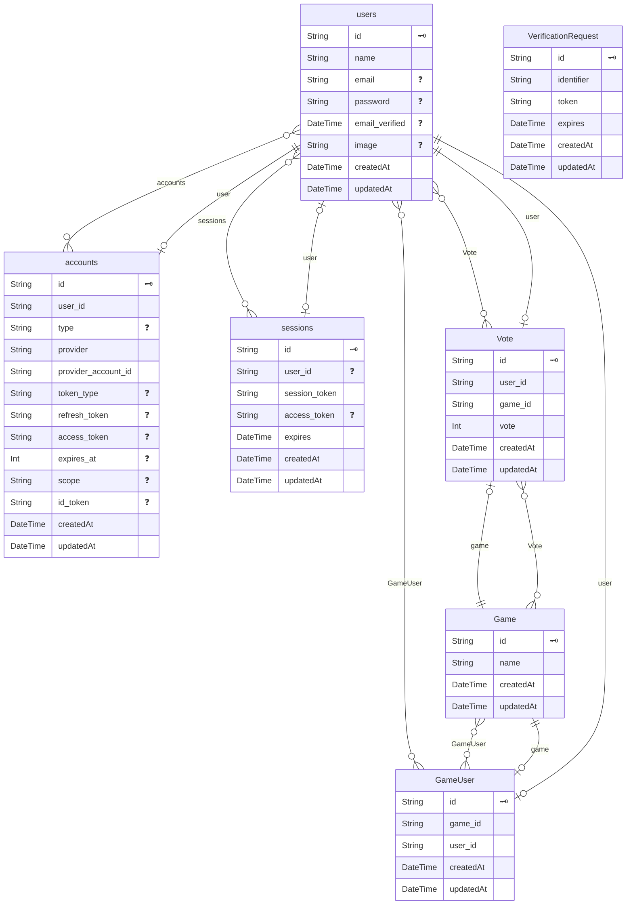

```mermaid
erDiagram

  "users" {
    String id "🗝️"
    String name 
    String email "❓"
    String password "❓"
    DateTime email_verified "❓"
    String image "❓"
    DateTime createdAt 
    DateTime updatedAt 
    }
  

  "accounts" {
    String id "🗝️"
    String user_id 
    String type "❓"
    String provider 
    String provider_account_id 
    String token_type "❓"
    String refresh_token "❓"
    String access_token "❓"
    Int expires_at "❓"
    String scope "❓"
    String id_token "❓"
    DateTime createdAt 
    DateTime updatedAt 
    }
  

  "sessions" {
    String id "🗝️"
    String user_id "❓"
    String session_token 
    String access_token "❓"
    DateTime expires 
    DateTime createdAt 
    DateTime updatedAt 
    }
  

  "VerificationRequest" {
    String id "🗝️"
    String identifier 
    String token 
    DateTime expires 
    DateTime createdAt 
    DateTime updatedAt 
    }
  

  "Game" {
    String id "🗝️"
    String name 
    DateTime createdAt 
    DateTime updatedAt 
    }
  

  "GameUser" {
    String id "🗝️"
    String game_id 
    String user_id 
    DateTime createdAt 
    DateTime updatedAt 
    }
  

  "Vote" {
    String id "🗝️"
    String user_id 
    String game_id 
    Int vote 
    DateTime createdAt 
    DateTime updatedAt 
    }
  
    "users" o{--}o "accounts" : "accounts"
    "users" o{--}o "sessions" : "sessions"
    "users" o{--}o "Vote" : "Vote"
    "users" o{--}o "GameUser" : "GameUser"
    "accounts" o|--|| "users" : "user"
    "sessions" o|--|o "users" : "user"
    "Game" o{--}o "Vote" : "Vote"
    "Game" o{--}o "GameUser" : "GameUser"
    "GameUser" o|--|| "Game" : "game"
    "GameUser" o|--|| "users" : "user"
    "Vote" o|--|| "users" : "user"
    "Vote" o|--|| "Game" : "game"
```
