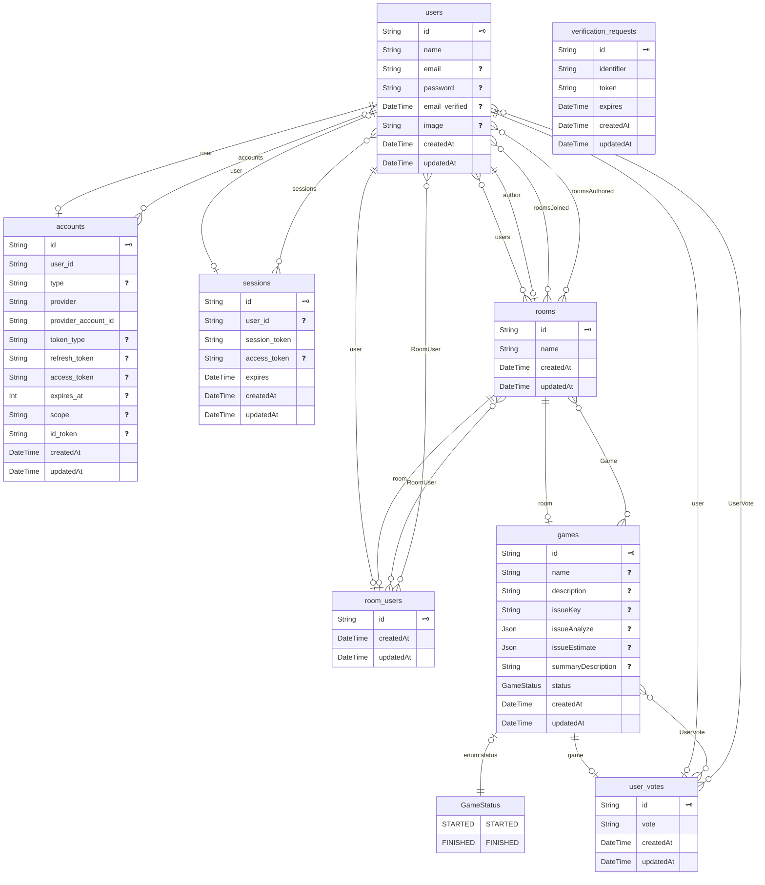

```mermaid
erDiagram

        GameStatus {
            STARTED STARTED
FINISHED FINISHED
        }
    
  "users" {
    String id "🗝️"
    String name 
    String email "❓"
    String password "❓"
    DateTime email_verified "❓"
    String image "❓"
    DateTime createdAt 
    DateTime updatedAt 
    }
  

  "accounts" {
    String id "🗝️"
    String user_id 
    String type "❓"
    String provider 
    String provider_account_id 
    String token_type "❓"
    String refresh_token "❓"
    String access_token "❓"
    Int expires_at "❓"
    String scope "❓"
    String id_token "❓"
    DateTime createdAt 
    DateTime updatedAt 
    }
  

  "sessions" {
    String id "🗝️"
    String user_id "❓"
    String session_token 
    String access_token "❓"
    DateTime expires 
    DateTime createdAt 
    DateTime updatedAt 
    }
  

  "verification_requests" {
    String id "🗝️"
    String identifier 
    String token 
    DateTime expires 
    DateTime createdAt 
    DateTime updatedAt 
    }
  

  "rooms" {
    String id "🗝️"
    String name 
    DateTime createdAt 
    DateTime updatedAt 
    }
  

  "room_users" {
    String id "🗝️"
    DateTime createdAt 
    DateTime updatedAt 
    }
  

  "games" {
    String id "🗝️"
    String name "❓"
    String description "❓"
    String issueKey "❓"
    Json issueAnalyze "❓"
    Json issueEstimate "❓"
    String summaryDescription "❓"
    GameStatus status 
    DateTime createdAt 
    DateTime updatedAt 
    }
  

  "user_votes" {
    String id "🗝️"
    String vote 
    DateTime createdAt 
    DateTime updatedAt 
    }
  
    "users" o{--}o "accounts" : "accounts"
    "users" o{--}o "sessions" : "sessions"
    "users" o{--}o "rooms" : "roomsAuthored"
    "users" o{--}o "rooms" : "roomsJoined"
    "users" o{--}o "user_votes" : "UserVote"
    "users" o{--}o "room_users" : "RoomUser"
    "accounts" o|--|| "users" : "user"
    "sessions" o|--|o "users" : "user"
    "rooms" o|--|| "users" : "author"
    "rooms" o{--}o "users" : "users"
    "rooms" o{--}o "games" : "Game"
    "rooms" o{--}o "room_users" : "RoomUser"
    "room_users" o|--|| "rooms" : "room"
    "room_users" o|--|| "users" : "user"
    "games" o|--|| "rooms" : "room"
    "games" o{--}o "user_votes" : "UserVote"
    "games" o|--|| "GameStatus" : "enum:status"
    "user_votes" o|--|| "users" : "user"
    "user_votes" o|--|| "games" : "game"
```
