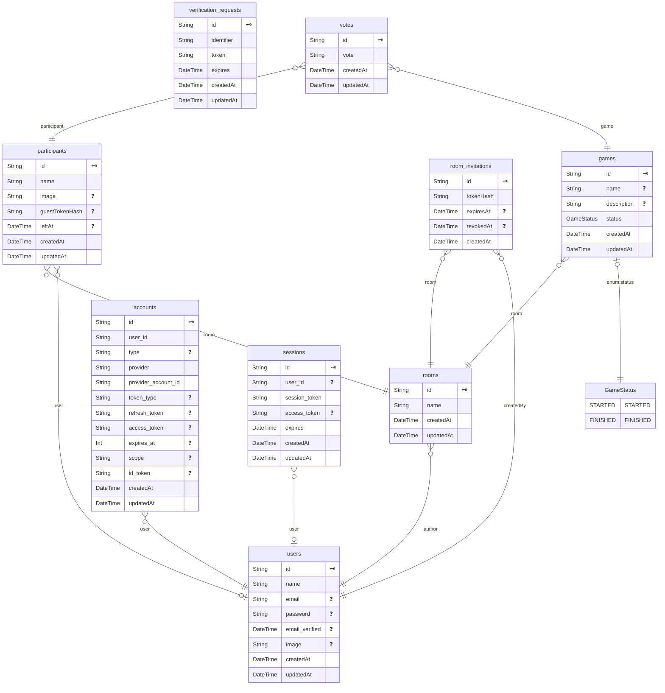

```mermaid
erDiagram

        GameStatus {
            STARTED STARTED
FINISHED FINISHED
        }

  "users" {
    String id "🗝️"
    String name
    String email "❓"
    String password "❓"
    DateTime email_verified "❓"
    String image "❓"
    DateTime createdAt
    DateTime updatedAt
    }


  "accounts" {
    String id "🗝️"
    String user_id
    String type "❓"
    String provider
    String provider_account_id
    String token_type "❓"
    String refresh_token "❓"
    String access_token "❓"
    Int expires_at "❓"
    String scope "❓"
    String id_token "❓"
    DateTime createdAt
    DateTime updatedAt
    }


  "sessions" {
    String id "🗝️"
    String user_id "❓"
    String session_token
    String access_token "❓"
    DateTime expires
    DateTime createdAt
    DateTime updatedAt
    }


  "verification_requests" {
    String id "🗝️"
    String identifier
    String token
    DateTime expires
    DateTime createdAt
    DateTime updatedAt
    }


  "rooms" {
    String id "🗝️"
    String name
    DateTime createdAt
    DateTime updatedAt
    }


  "participants" {
    String id "🗝️"
    String name
    String image "❓"
    String guestTokenHash "❓"
    DateTime leftAt "❓"
    DateTime createdAt
    DateTime updatedAt
    }


  "room_invitations" {
    String id "🗝️"
    String tokenHash
    DateTime expiresAt "❓"
    DateTime revokedAt "❓"
    DateTime createdAt
    }


  "games" {
    String id "🗝️"
    String name "❓"
    String description "❓"
    GameStatus status
    DateTime createdAt
    DateTime updatedAt
    }


  "votes" {
    String id "🗝️"
    String vote
    DateTime createdAt
    DateTime updatedAt
    }

    "accounts" }o--|| users : "user"
    "sessions" }o--|o users : "user"
    "rooms" }o--|| users : "author"
    "participants" }o--|| rooms : "room"
    "participants" }o--|o users : "user"
    "room_invitations" }o--|| rooms : "room"
    "room_invitations" }o--|| users : "createdBy"
    "games" }o--|| rooms : "room"
    "games" |o--|| "GameStatus" : "enum:status"
    "votes" }o--|| participants : "participant"
    "votes" }o--|| games : "game"
```
